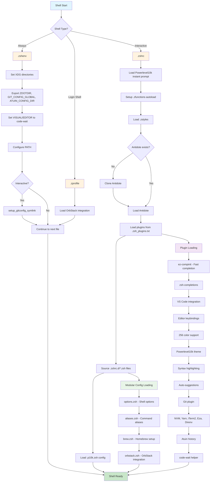

This document explains the concepts and startup behavior of the [**Dotfiles** repository](https://github.com/dfinster/dotfiles).

**Dotfiles** provides a clean, organized way to manage your shell environment and development tools. It centralizes configuration for Zsh, Git, and Atuin, allowing you to maintain a consistent setup across different machines by storing everything in a single repository.

This is inspired by [`getantidote/zdotdir`](https://github.com/getantidote/zdotdir) and uses Antidote to manage Zsh plugins.

## Location and startup

**Dotfiles** is designed to run from `~/.config/dotfiles`. It uses the XDG Base Directory Specification to define where configuration, data, and cache files are stored, making it easy to manage your dotfiles in a single repository.

During installation, you'll remove the majority of your existing dotfiles from your home directory, as they are now managed in this repository. A bare minimum of configuration dotfiles are stored in your home directory to bootstrap the system and set local configuration:

- `~/.zshenv` bootstraps the system.
- `~/.gitconfig.local` sets your Git username, email, and signing key.

As much as possible is moved to `~/.config/dotfiles`, which contains all the configuration files for Zsh, Git, and Atuin. This keeps your home directory clean and organized.

## Environment

Dotfiles sets these variables in `~/.config/dotfiles/zsh/.zshenv`:

- `ZDOTDIR`: Where Zsh looks for configuration files
- `XDG_CONFIG_HOME`: Where applications store configuration
- `XDG_DATA_HOME`: Where applications store persistent data
- `XDG_CACHE_HOME`: Where applications store temporary cache files
- `GIT_CONFIG_GLOBAL`: The global Git configuration file
- `ATUIN_CONFIG_DIR`: The directory for Atuin configuration

The main directories in the repo are:

- **`atuin/`** - Enhanced command history configuration
- **`git/`** - Git configuration and global ignore patterns
- **`zsh/`** - All shell-related configuration

## Loading Order

The shell loads the following files in this order to set up the environment:

1. **`zsh/.zshenv`** - Always loaded first, sets up environment
2. **`zsh/.zprofile`** - Login shells only, minimal setup
3. **`zsh/.zshrc`** - Interactive shells, loads plugins and features
4. **`zsh/.zshrc.d/*.zsh`** - Modular configurations loaded alphabetically

This layered approach ensures that environment variables are available when needed, and interactive features only load when appropriate.

### PATH Management

The PATH is carefully constructed to prioritize user tools while maintaining system functionality:

1. **User binaries** (`~/bin`, `~/.local/bin`) - Highest priority
2. **Package managers** (Homebrew, MacPorts) - Medium priority
3. **System binaries** - Lowest priority but preserved

This ensures your custom tools take precedence while keeping the system functional.

## Shell Configuration

The shell is configured with quality-of-life improvements:

- **Auto-cd**: Type a directory name to change to it (no `cd` needed)
- **Spelling correction**: Suggests fixes for command typos
- **Extended globbing**: Advanced pattern matching with `**`, `~`, `^`
- **Smart history**: Removes duplicates, saves immediately

### Modular Configuration System

Instead of one massive `.zshrc` file, configuration is split into logical modules in `.zshrc.d/`:

- **`aliases.zsh`** - Command shortcuts and convenience aliases
- **`brew.zsh`** - Homebrew package manager integration
- **`options.zsh`** - Core shell behavior settings
- **`orbstack.zsh`** - Container platform integration

### Custom Functions

The `.zfunctions/` directory contains utility functions that are auto-loaded. These functions provide additional capabilities.

- **`is-macos`** - Detect macOS for conditional logic

## Git Integration

Instead of manually editing `~/.gitconfig`, this system uses a structured approach to manage Git configuration. The `git/` directory contains:

- **`git/.gitconfig`** - Global Git settings shared across all repositories
- **`git/.gitignore_global`** - Patterns to ignore across all repositories

### Security-First Approach

Git is configured with security best practices:

- **SSH commit signing** using 1Password integration
- **Automatic signing** for all commits
- **Credential storage** in macOS Keychain
- **URL rewriting** to use SSH instead of HTTPS for GitHub

### Developer Workflow Enhancements

Git behavior is optimized for modern development:

- **Rebase by default** for cleaner history
- **VS Code integration** for diffs and editing
- **Helpful aliases** for common operations
- **Smart conflict resolution** with rerere

### Global Ignore Patterns

The `.gitignore_global` file instructs Git to ignore these file and directories across all repositories:

- **`*.local.*`** - Local configuration files
- **`*.local`** - Local directories
- **`.DS_Store`** - macOS Finder metadata files

## Dotfiles Startup Sequence

## Loading Order Summary

1. **Always loaded**: `.zshenv` - Environment setup, XDG directories, Git symlink
2. **Login shells**: `.zprofile` - OrbStack integration
3. **Interactive shells**: `.zshrc` - Plugins, themes, and modular configurations

### Key Components

- **Environment**: XDG directories, PATH, editor configuration
- **Git Integration**: Auto-symlink ~/.gitconfig for compatibility
- **Plugin Manager**: Antidote loads plugins from `.zsh_plugins.txt`
- **Modular Config**: Auto-sources all `.zshrc.d/*.zsh` files
- **Theme**: Powerlevel10k with custom configuration
